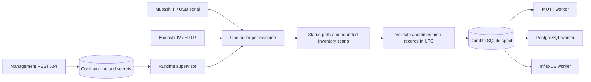

# Architecture and implementation status

This document describes the intended complete system. A partial backend now exists; consult the [source-of-truth map](ssot.md), code, and ticket evidence before treating a section as delivered. The [working contract](specs/rebuild-contract.md) records provisional limits and unresolved site choices.

## Goal and scope

An operator configures multiple Musashi II and IV machines, then collects **all available read-only status, settings, metadata, and logs** documented for each model, excluding IV screen images. The status polling interval is set per machine; its default and minimum are 1 second. Full channel, recipe, and configuration inventories run as bounded background sweeps. The system never changes machine settings or runs control actions. See the [read-only data catalog](reference/device-protocols.md).

Operators can select one or more destinations: MQTT, PostgreSQL, and InfluxDB. Collection, the durable spool, and forwarding have separate module contracts in one service. Collection can commit records with no destination selected; a destination added later receives retained history. Each destination has its own delivery state, so one outage does not block the others. The design adapts the Config Center, SQLite spool, and delivery worker ideas in `../daqnavi-data-forwarder/docs/architecture.md` for several low-rate Musashi machines.

## Configuration and control through the REST API

The service is operated through its management REST API and configuration file, with a browser console served from the same origin. M34 and M35 track the API and operational UI acceptance work; M36 and M37 track the independent backend and browser login migration. The console has no direct machine or destination access. The API exposes health and status reads, configuration read/update, and runtime Start/Stop operations; machine and destination connection tests remain M21 work. Configuration updates use revision checks, validation, secret redaction, and are allowed only while acquisition is stopped. The browser console and browser-facing API use the shared local `admin` account and session login defined in [ADR 0003](adr/0003-shared-session-login-for-the-operator-console.md); API clients outside the browser UI are out of scope.

To change a model, connection, interval, or destination, stop acquisition, update configuration, test the connection, then start acquisition. Status and inventory coverage are available from the API. Auto-start after reboot is off by default until recovery has been tested.

## Data flow



Each machine has a status poller and an inventory scan queue. The poller uses its `poll_interval_seconds`, a finite number of at least 1 checked by the API/config layer. A monotonic clock schedules reads. Status and inventory requests to one machine are serialized; this is important for II's half-duplex serial link and IV's client limit. Large inventories are split into bounded work units so status reads can resume between them. The configured interval is a target, not a promise that every channel and record type refreshes every second. Report lag, skipped cycles, scan coverage, and scan age through the API. Never fill a missed cycle with an old value. One failed machine must not stop the others.

Use a versioned record envelope for every successful read: stable `record_id`, `machine_id`, `model`, `record_type`, `source`, `observed_at` in UTC, optional channel/recipe ID, parsed values with units, quality, and the original response when safe. Types include live status, channel settings, recipe settings, machine metadata, and log/export data. Preserve model-specific fields without inventing a shared meaning. A failed read produces an error event and health update, not a stale data record. Full inventories have scan IDs and completion state so consumers can distinguish a complete snapshot from partial coverage.

Commit records to the SQLite spool before delivery. Track acknowledgments separately for each destination. MQTT uses QoS 1 and waits for PUBACK. PostgreSQL uses a unique `record_id` to handle replay. The spool assigns [stable Influx point identity](adr/0001-influx-point-identity.md); an external bucket round trip remains open. Large JSON and TSV responses need documented size limits and destination encodings; reject an unsupported destination/record-type combination during setup rather than silently omitting data. Delivery is at least once, so downstream systems must tolerate duplicates. Under [ADR 0002](adr/0002-independent-collection-and-destination-rerouting.md), changing a destination moves only its pending assignments to the new endpoint; confirmed deliveries and other destinations are untouched. The current implementation still leaves pending assignments on the old target, so rerouting remains an acceptance gap.

The spool has a size limit. The [execution contract](specs/agent-execution-contract.md) sets a configurable count for pruning unassigned and fully acknowledged history under quota pressure; a later destination can backfill only the retained window. If a record cannot be committed because protected data fills the spool, stop reads and show a fault. After restart, committed records remain available for retry and an incomplete inventory scan remains visible; the worker starts a new scan rather than resuming its old request cursor. A read that finished but was not committed can be lost. Show gaps and faults in status. Size the spool from status rates, channel/recipe counts, large exports, machine count, and required outage duration.

## Docker and security

Compose runs only the ingestion application. MQTT, PostgreSQL, and InfluxDB are external services. Persist config and spool in volumes. Map only the required USB devices instead of using `privileged: true` or mounting all of `/dev`. Check that the container can reach IV IP addresses and destinations, and can open the serial devices on the real host.

Restrict network access to the management API. The shared operator login defaults to username `admin` and password `00000000`, configurable through environment secrets. No forced password change, login throttling, or account lockout is planned. Browser API requests use server-side sessions and CSRF protection; sessions expire after 8 hours idle or 24 hours total and are invalidated on restart. `MUSASHI_ALLOWED_ORIGINS` accepts exact origins by default. Setting it to `*` accepts any syntactically valid same-origin Host/Origin authority and removes the application's host allowlist; anyone who can route to the published port can reach the sign-in page and attempt login. This does not add CORS response headers. Direct HTTP is unencrypted, so deployments that need transport encryption must terminate TLS at their reverse proxy and configure its HTTPS `MUSASHI_PUBLIC_ORIGIN`; HTTPS origins receive Secure cookies. Keep destination passwords, database DSNs, and broker credentials in permission-limited files or secret mounts; redact them from API responses and logs. Use TLS for destination connections where supported. IV supports HTTP only, so keep its network access restricted and do not expose it to the Internet.

## Proposed project layout

```text
README.md
docs/
  architecture.md
  development-plan.md
  tickets/                    # One detailed file per development ticket
  reference/device-protocols.md
examples/                     # Existing manuals and examples
src/musashi_ingestion/
  api/                         # Setup, control, status, auth
  config/                      # Schema, validation, persistence
  devices/                     # II serial and IV HTTP adapters
  runtime/                     # Supervisor, scheduler, health
  pipeline/                    # Normalization, spool, delivery
  destinations/                # MQTT, PostgreSQL, InfluxDB
tests/
  fixtures/                    # Synthetic and sanitized device responses
  unit/
  integration/
Dockerfile
compose.yml
.env.example
```

The backend package, API, adapters, SQLite spool, delivery modules, Dockerfile, Compose file, and initial operator console now exist. The II example previously read a real machine, but no hardware is connected now. IV and destination behavior still need integration and site confirmation. The console has been served through a private Tailscale HTTPS endpoint; full M34/M35 acceptance and access from the operator's own device have not been confirmed.
